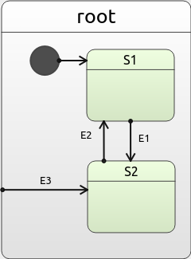
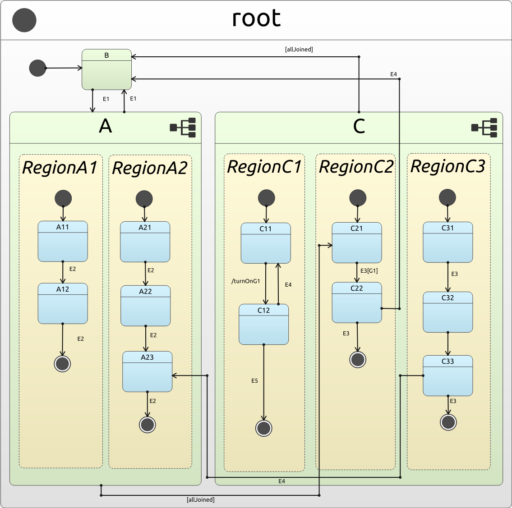

# Developers Guide to Roost HSM

Welcome to the Developers Guide for the Roost HSM framework!  Roost HSM is a C++11 Hierarchical State Machine (HSM) framework that adheres to the following design guidelines:
- Must be able to support hundreds of transitions and states without long compile times or bad run-time performance.
- Must minimize the amount of memory allocation done by the framework after initialization.
- The Transition Table form factor must be the way to show how a state reacts to an event.

Using these guidelines, the framework implements a UML-compliant state machine with important features like:
- Leaf and Composite states
- Orthogonal Regions
- History (shallow and deep)

This guide will help you understand the terminology used by Roost HSM as well as implement all the features needed for robust and scalable state machines.  

Note this guide is posted under the Creative Commons BY-SA 4.0 license.  All code within this repository is held under the terms found in the LICENSE file.  For more information, see the [Legal](#legal) Section.


Contact: <dev@akiscode.com>


## Table of Contents
1. [Introduction](#introduction)
1. [Basic Terminology](#basic-terminology)
1. [Basic Components of Roost HSM](#basics-roost-hsm)
1. [Leaf and Composite States](#leaf-and-composites)
1. [Transitions](#transitions)
1. [Guards and Actions](#guards-and-actions)
1. [Firing Events with a State Machine](#firing-events)
1. [Example 1 - Multiple Composite States With Actions and Guards](#example1)
1. [Orthogonal Nodes and Regions](#orthogonal)
1. [History Nodes](#history)
1. [Unit Testing](#unit-testing)
1. [Advanced Roost HSM Features](#advanced-features)
1. [Legal](#legal)

---

## Introduction <a name="introduction">

Roost HSM was created due to frustrations that there was not a comprehensive Hierarchical State Machine (HSM) C++ framework that was suitable for projects that employ a massive amount of states and transitions.  The most commonly recommended framework for C++ is Boost MSM, [but even they recommend that it should not be used when the state machines get big](https://www.boost.org/doc/libs/1_74_0/libs/msm/doc/HTML/ch04s04.html).

Despite the limitations of Boost MSM, the most powerful part of that framework is the _Transition Table_ which allows for developers to quickly determine the functionality of a state and what the program flow looks like.  Thus the goal of replicating the Transition Table form factor in a state machine framework was born.  

Additionally, we wanted to add new functionality that allows one to unit test better as well as the ability to share data across state machines in an easier fashion.  Combined together, we feel that we have achieved that and hope you find it as useful as we have!

## Basic Terminology <a name="basic-terminology">

Before one understands what a Hierarchical State Machine (HSM) is, one has to understand the basic terminology and concepts of a Finite State Machine (FSM).  

A FSM is a programming construct that enforces that the program reside in only one of a _finite_ number of _states_.  Moving between one state to another (known as a transition) is the result of receiving an event that satisfies the guard conditions of the associated transition.  In order for a FSM to be valid, there must a list of states, an initial state and a definition of what transitions are associated with each state.


### Transitions, Events, Guards and Actions

In order to define what a transitions for each state are, a standard notation needs to be created.  The UML standard has defined the following notation for transitions:

`EVENT[GUARD]/ACTION`

Let's break this down:
- `EVENT` represents the event and/or input that comes into the state.  This is a required field.
- `GUARD` is an expression that returns either `True` or `False`.  If the expression returns `True`, then the event is allowed to be consumed by the current state.  Otherwise it is ignored as a candidate.  If omitted, then this evaluates to `True`.
- `ACTION` is an expression that is executed if the transition is accepted by the current state.  If omitted, then no expression is evaluated. Note that this may be a series of one or more functions.

Often times you will see various forms of this notation with either `GUARD` or `ACTION` absent.  Such as:

- `EVENT_A[foo == bar]` or `EVENT_A[foo == bar]/`
  - `EVENT_A` is only consumed when `foo == bar`.  There is no `ACTION` defined.
- `EVENT_A[]/functionFooBar()` or `Event_A/functionFooBar()`
  - `EVENT_A` will always be consumed as there is no `GUARD` defined.  After this is consumed, the `functionFooBar()` action will be evaluated.
- `EVENT_A[]/` or `EVENT_A`
  - `EVENT_A` will always be consumed as there is no `GUARD` defined.  No `ACTION` is defined either.


Lets use this notation to create a simple FSM:

<div align="center">

</div>

Let's break this down:
- The initial state is the `Off` state (shown with the double circle outline).  This means that when the FSM first starts it will be in the `Off` state.  All FSMs require an initial state.
- From the `Off` state, we see we receive the event `Press Power Button` which transitions us into the `On` state.  
- From the `On` state we can receive the `Press Power Button`, but it looks like there are two different arrows (i.e. transitions) that this could take.  From our understanding of transition notation, we know that the `All Programs Exited` guard determines which transition is executed.  Because the guard covers all possible transitions, we can deterministically select the correct transition.
  - Some people may wonder what happens when the guards don't allow for a deterministic selection of transitions.  This will be covered in the [Transitions](#transitions) section.
- Assuming that not all programs have exited, we end up in the `Waiting` state.  After which a `Programs Shutdown` event will bring us back to the `Off` state.


What was just shown is an example of a FSM.  With that squared away, it is time to understand what an HSM can do.

### HSM vs FSM

The distinction between HSM and FSM is within the name: Hierarchy.  An HSM can be viewed (in a certain sense) as simply an FSM with each state having the potential of being _another_ FSM.  This allows for events to be evaluated in a hierarchical fashion such that multiple states can share the same handling transition.  This is analogous to inheritance and virtual functions in C++: classes which derive from a base class share common virtual functions but have the option of overriding them for their specific case.

With this hierarchy comes a new transition selection progress (which we will cover more in [Transitions](#transitions)) as well as the concept of "Run To Completion" (RTC).  This concept does **not** mean that the thread running the FSM/HSM can not be interrupted, but rather the event and its associated actions must be run fully before evaluating another event.  

Let's take a look at a sample FSM and how HSMs allow us to write cleaner more concise code.

<div align="center">

</div>

In the above FSM, we see that States `A`, `B`, and `C` all have a transition on event `Error` that leads to the `Recovery` state.  These transitions are all identical except for the fact that they originate from different states, a perfect time to use HSMs!

Here is what an analogous HSM would look like:

<div align="center">

</div>

If we look at this HSM, we see that we maintain the transitions between `A`, `B` and `C` but we have a new transition from the `DComposite` state to recovery.  This is how it works:

- Assume we are in state `B` when we get the `Error` event.  
- We don't handle the `Error` event, so we go "up" one level to `DComposite` which does handle `Error`.
- So we transition from state `B` to `Recovery`.
- Note this could happen from states `A` or `B` as well!

So how did this happen?  We can think of states `A`, `B`, `C` and `Recovery` has being _children_ of the state `DComposite`.  So they share any transitions that might be held by `DComposite` that they themselves don't define.

This can be easily seen if we show the tree representation of the HSM:

<div align="center">

</div

Looking at the HSM in this way shows the "children" (aka _leaf_) nodes easily with the _composite_ node called "DComposite".  The term _node_ can be used generically to refer to any object found in this tree representation.

To further cement why this, lets think about it in terms of virtual functions in C++:

```c++
struct DComposite 
{

  virtual void handle(Event const& e) 
  {
    switch(e)
    {
      case Event::Error:
       ...
      break;
    }
     ...
  }

};

struct B : public DComposite
{

  void handle(Event const& e) override 
  {
    case Event::E2:
      ...
    break;

    default:
      DComposite::Handle(e);
    break;
  }

}

```
Given this setup, if we created a classic base pointer to derived class the analogy becomes clear:

```c++

enum class Event 
{
  E1,
  E2,
  Error
};

DComposite* hsm = new B();

hsm->handle(Event::Error);
```
Again, just as in HSMs, the "most derived" class has priority over the other virtual functions.  Only if the derived doesn't handle it do we "go up" the tree to find if someone does.

---

## Basic Components of Roost HSM <a name="basics-roost-hsm">

In this section we will talk about how to begin building up the basic common components of a Roost HSM state machine along with describing the theory behind them.  Going through this we will be looking at code found in the `examples/quickstart` folder.  

### Instastart vs Quickstart?
Before we talk about the code found in quickstart, it is important to describe difference between it and the instastart example.  Both examples (instastart and quickstart) implement the exact same state machine, the only difference is that instastart does it in one file while quickstart spreads this out across multiple.

**The Key Difference**: Quickstart contains a _explicit template instantiation_ in the `common.hpp` and `common.cpp` files that allows for reduced compile times (highly important once your state machine gets to hundreds of states and transitions) **and** reduced executable size.  By starting with the format provided in quickstart, you are beginning development of your HSM correctly.


### Common Components

The first step to building up a HSM is to setup the three things that are common to every state in your state machine:
1. Events
1. The Context
1. A type definition for your state machine

The quickstart example shows the following code to set this up:

```c++
/// common.hpp

#ifndef ROOST_QUICKSTART_COMMON_HPP
#define ROOST_QUICKSTART_COMMON_HPP

#include "roost/state_machine.hpp"

namespace quickstart
{

enum class Evt
{
    ROOST_NONE,  // Enforced by framework
    E1,
    E2,
    E3
};

static const char* EvtStrings[] = {"NONE", "E1", "E2", "E3"};

ROOST_ENUM_PRINT_HELPER(Evt, EvtStrings)

class RootState;

struct Ctx
{
    RootState* m_root;

    // Example variables you can share
    int i;
};

}  // ns: quickstart

// Use explicit template instantiation to help with compile times, see common.cpp
// for other key part
extern template class roost::NodeAlias<quickstart::Ctx, quickstart::Evt>;

namespace quickstart
{

using SMTypes = roost::NodeAlias<Ctx, Evt>;

}  // ns: quickstart

#endif  // ROOST_QUICKSTART_COMMON_HPP
```

```c++
/// common.cpp

#include "common.hpp"

// Instantiate the template here
template class roost::NodeAlias<quickstart::Ctx, quickstart::Evt>;
```

We will break down each component in the following sections.

#### Events

Events in Roost HSM are represented as an enum class that must contain a member called `ROOST_NONE` (this is an event used to represent _completion_ events, more in [Transitions](#transitions)):

```c++
enum class Evt
{
    ROOST_NONE,  // Enforced by framework
    E1,
    E2,
    E3
};

static const char* EvtStrings[] = {"NONE", "E1", "E2", "E3"};

ROOST_ENUM_PRINT_HELPER(Evt, EvtStrings)
```

Also defined is a static array of `const char *` representing the printable versions of each of those events.  It is highly important this be defined because it allows us to trace through the states when unit testing.  A helper macro allows us to define the important functions needed to translate between the enum and `const char *`.

##### Why enums?
Some people who are familiar with HSMs are probably asking: How do you package data with an event in Roost HSM?  The answer is: you can't.  We have made the choice to use enums because they allow us to simplify instantiation and handling of events in our states.  

Without enums, the user would have to derive events from an "Events" base class and provide a way of converting the base event into the concrete instantiation. This conversion would have to be kept up to date with every addition or removal of events. This is something we have found to be burdensome and ultimately not needed.

If you need to associate data with an event, we recommend that before firing an event you update the data found in the _Context_ (see later section) or some other shared data repository.  This would mean that the event would know what data to seek out and act upon it without the need to package data with the event.

#### The Context

One of the most common struggles in using most HSM frameworks is sharing data between all the states.  While we always recommend that you keep data as local as possible (preferably inside the states themselves), often times it is impossible and/or not practical to do this.

To address this, Roost HSM has the concept of a _Context_ (often abbreviated as `Ctx`) that is baked into the state machine instantiation via a template parameter.  Let's look at the example:

```c++
class RootState;

struct Ctx
{
    RootState* m_root;

    // Example variables you can share
    int i;
};
```

As we see, the Context is simply a struct that contains the variables we want to share globally.  The integer `i` in the above example could be modified by any state that shares this context.

The one member of the context that is vital for all state machines created to have is a pointer to the _root state_ (aka the composite state that contains all other states).  By convention, these examples will call that state `RootState`.  

This pointer allows states to create transitions that can _explicitly enter_ any other state within the state machine regardless of how deep they are in the hierarchy.  However, because the `RootState` is defined with the other states, we must use a forward declaration to avoid a circular dependency.

#### The Type Definitions

After defining the Events and Context for your state machine, it is time to create your own state machine type definition that marries them together for use by other files. Let's take a look:

```c++
/// common.hpp

// Use explicit template instantiation to help with compile times, see common.cpp
// for other key part
extern template class roost::NodeAlias<quickstart::Ctx, quickstart::Evt>;

namespace quickstart
{

using SMTypes = roost::NodeAlias<Ctx, Evt>;

}  // ns: quickstart
```

```c++
/// common.cpp

#include "common.hpp"

// Instantiate the template here
template class roost::NodeAlias<quickstart::Ctx, quickstart::Evt>;
```

The definition of the type is found here:

```c++
using SMTypes = roost::NodeAlias<Ctx, Evt>;
```

which is simple enough.  But what we also see is an _explicit template instantiation_ that makes it so that the new type definition does not get copied to every header file when included.  Instead we instantiate the template in the `common.cpp` file once, and include just a reference to the templates in other header files.  This reduces our compilation time and executable size!

One thing to note is the fact that the explicit template instantiation has to be within the "global" namespace (not in the quickstart namespace) which is why you see the rather weird placement of it.

Defining the types allows you to access the following aliases:

```c++
/// lib/include/roost/state_machine.hpp

template <typename CTX, typename E>
class NodeAlias
{
public:
    using Node               = roost::Node<CTX, E>;
    using Leaf               = roost::LeafNode<CTX, E>;
    using Composite          = roost::CompositeNode<CTX, E>;
    using Orthogonal         = roost::OrthogonalNode<CTX, E>;
    using Region             = roost::RegionNode<CTX, E>;
    using StateMachine       = roost::StateMachine<CTX, E>;
    using Spy                = roost::Spy<CTX, E>;
    using PrintingSpy        = roost::PrintingSpy<CTX, E>;
    using TracingSpy         = roost::TracingSpy<CTX, E>;
    using PrintingTracingSpy = roost::PrintingTracingSpy<CTX, E>;
    using IErrorSpy          = roost::IErrorSpy<CTX, E>;
    using StandardErrorSpy   = roost::StandardErrorSpy<CTX, E>;
};  // Struct: NodeAlias
```

---

## Leaf and Composite States <a name="leaf-and-composites">

Once we have our common elements its time to start creating our core classes: leaf and composite states.  Let's take a look back at the tree representation of a state machine:

<div align="center">

</div

We see that states `A`, `B`, `C` and `Recovery` have no _children_ nodes, thus they are _leaf_ states.  However, `DComposite` has children (`A`, `B`, `C` and `Recovery`) and so it is a _composite_ state.  So the distinguishing feature between leaf and composite states is if they have children or not.

### Initial States

An important aspect of composite states is that because they have children, there must always be an _initial state_.  An initial state is the state that the state machine "falls into" on initialization.  What does this mean?

In order to be considered _stable_, a state machine always needs to have its current state be at a leaf node.  If it currently points to something other than a leaf node, then it is _unstable_ and must find its way to a leaf node through initial states.

Using the above example:

- We start at the `DComposite` state.  Since it isn't a leaf state, we want to go to the `A` state (the initial state).
- `A` is a leaf state so we are considered stable at this point.

**IMPORTANT**: Initial states must always be *direct* children of the current composite state.  They can not reference nodes other than this.  If this isn't the case, then the Roost HSM framework will fail initialization and not allow events to continue. 

Example:

<div align="center">

</div>

`DComposite` can *only* have the states `A` or `B` be initial states.  The `A` state can *only* have `F` be its initial state.


#### Orthogonal States and Completion Events

Two points to note on the above rules:
- Orthogonal nodes have multiple initial states, which results in multiple current nodes.  However, the rule that a state machine must always have current nodes be leaf states still holds. See [Orthogonal Nodes and Regions](#orthogonal).
- A state machine will fire a _completion event_ after becoming stable which might cause further transitions.  See [Transitions](#transitions).
 

### Leaf and Composite States in Roost HSM

Now is the time to start implementing leaf and composite states in Roost HSM.  We will be looking at code found in the `examples/quickstart` folder which implements the following state machine:


| HSM Diagram                                                | Tree Representation                                   |
|------------------------------------------------------------|-------------------------------------------------------|
|  |  |


And the code:

```c++
/// quickstart_sm.hpp

#ifndef ROOST_QUICKSTART_SM_HPP
#define ROOST_QUICKSTART_SM_HPP

#include "common.hpp"

namespace quickstart
{

class S1 : public SMTypes::Leaf
{
public:
    S1(const char* name, Ctx& ctx, SMTypes::Node* parent) : SMTypes::Leaf(name, ctx, parent)
    {
    }

    void createTransitionTable() override;
};

class S2 : public SMTypes::Leaf
{
public:
    S2(const char* name, Ctx& ctx, SMTypes::Node* parent) : SMTypes::Leaf(name, ctx, parent)
    {
    }

    void createTransitionTable() override;
};

class RootState : public SMTypes::Composite
{
public:
    RootState(const char* name, Ctx& ctx, SMTypes::Node* parent)
        : SMTypes::Composite(name, ctx, parent, &m_s1),
          m_s1("s1", ctx, this),
          m_s2("s2", ctx, this)
    {
    }

    S1 m_s1;
    S2 m_s2;

    void createTransitionTable() override;
};

}  // ns: quickstart

#endif  // ROOST_QUICKSTART_SM_HPP
```

#### Leaf States

Let's take a look at the `S1` state (the `S2` state is nearly identical):

```c++
class S1 : public SMTypes::Leaf
{
public:
    S1(const char* name, Ctx& ctx, SMTypes::Node* parent) : SMTypes::Leaf(name, ctx, parent)
    {
    }

    void createTransitionTable() override;
};
```

We see that to create a leaf state we must inherit from the `SMTypes::Leaf` type we created earlier in our common components header file.  We then have a constructor that takes in three parameters:

1. A name - a human readable string that will identify this state
1. A context reference - the reference to the context 
1. A pointer to our parent node - a pointer to the node (aka state) that is parent to this node

which then passes those parameters to the `SMTypes::Leaf` constructor.  

These three parameters will be common to all nodes we create with this framework and will always be in this order.  Note that some nodes may have _more_ parameters, but they all will have _at least_ these three.

Some people might be asking, why not define what the name (or another parameter) will be now?  That's because we are going to wait until the composite state to define what the concrete instantiation of this will look like.

Note the `createTransitionTable()` function will be explained in the [Transitions](#transitions) section.

#### Composite States

Our "Root State" (by convention called `RootState`) is defined as such:

```c++
class RootState : public SMTypes::Composite
{
public:
    RootState(const char* name, Ctx& ctx, SMTypes::Node* parent)
        : SMTypes::Composite(name, ctx, parent, &m_s1),
          m_s1("s1", ctx, this),
          m_s2("s2", ctx, this)
    {
    }

    S1 m_s1;
    S2 m_s2;

    void createTransitionTable() override;
};
```

We see that we have the same three parameters exposed in the constructor, but when calling the `SMTypes::Composite` constructor we have an extra parameter: the initial state.  This is represented as a pointer to the member variable `m_s1` which represents the instantiation of the `S1` state.

Further in the constructor, we see that both `m_s1` and `m_s2` are given their names, a context reference and the parent pointer (which is `this` because the composite state is the parent of both states).

Note the `createTransitionTable()` function will be explained in the [Transitions](#transitions) section.

### The Root State

An important concept to grasp is one of the "root state".  Although by convention in this framework we call it `RootState` it doesn't have to be called that.  The root state is a composite state that encapsulates all other states within the state machine.  Thus there is one entry point to attach to when creating the `StateMachine` class.  More will be described in later sections, but for now it is important that you have a "root state" in your code.

---

## Transitions <a name="transitions">

Transitions are one of the most important aspects of a state machine.  They determine how events are handled, which state you end up in and which actions are called at what time.  While it may seem like an easy task to determine which transition is taken, there are some subtleties that the UML standard does not address that Roost HSM takes care of.  Read this section carefully!

### OnEntry and OnExit

The first thing to understand about transitions is the concept of _entering_ and _exiting_ a state.  These are analogous to constructors and destructors in the C++.  If a state is said to be entered then its `onEntry()` function is called.  Likewise if a state is said to be exited then its `onExit()` function is called.

These functions are optionally defined and can be done like so for any node:

```c++
class S1 : public SMTypes::Leaf
{
public:
    S1(const char* name, Ctx& ctx, SMTypes::Node* parent) : SMTypes::Leaf(name, ctx, parent)
    {
    }

    // onEntry and onExit can be optionally defined for any node
    void onEntry() override
    {
        // Do on entry action here
    }

    void onExit() override
    {
        // Do on exit action here
    }

    void createTransitionTable() override;
};
```

Often times it is useful to use a short hand to indicate which states were entered and which were exited in a specific order.  To do that we prepend either `OE-` or `OX-` to the state name and list them out.  For instance, if we entered states `S1`, `S2` and exited states `S3` and `S4` (in that order) then the notation would be:
```bash
OE-S1, OE-S2, OX-S3, OX-S4
```

### The Current Node

The concept of the "current node" is something we have briefly touched on before but it is something that we should cover here in more detail.  As the name implies, the current node is the node which the state machine currently is at, whether stable or unstable.  As the state machine enters and exits states (i.e. nodes in the tree), then the current node is updated to reflect that.  

The most important part of the current node concept is that there **can only be one current node at a time within a region**.  So what is a region? A region is a section of the HSM that operates independently in execution of event processing.  Most likely this definition doesn't help, so let's see some examples.

Take this HSM:
<div align="center">

</div>

By default, all state machines in Roost HSM have this hidden region called `Top` that is normally omitted from most diagrams:

<div align="center">

</div>

All nodes are contained within the "Top Region" (the blue rectangle), so we can assume that only one of those nodes will be the "current node" at any time.  

This inevitably leads to the question: can more than one region exist?  Yes!  The only way to do that is through the use of Orthogonal Nodes, which we cover in [Orthogonal Nodes and Regions](#orthogonal).


### Initial Transitions

An initial transition is a transition that occurs to get the state machine as a whole into a stable state.  Remember a stable state is one where the current node is a leaf state.  The process of doing this is done by following the initial states until a leaf node is hit.  **Because initial states can only be direct sub-states, following them will eventually lead to a leaf node.**

Initial transitions occur in two different scenarios:
1. You have just initialized the state machine
1. You have just completed a transition to a non-leaf node

Let's see how this would work with the following state machine:

#### Scenario 1: State Machine Initialization

Here `DComposite` is our root state, so when we initialize the state machine the current node is going to start at `DComposite`.  Following our logic, the state machine will continually find initial states until we hit a leaf node.  In this case we will enter the following nodes in this order:

1. `DComposite`
1. `A`
1. `F`

Since we are entering these nodes, we also will be calling the `onEntry` functions for each of those nodes in that order.  We can show this via a notation as such:

```bash
OE-DComposite, OE-A, OE-F
```

#### Scenario 2: Transition between states

In this scenario, lets assume that we have transitioned from a state and ended the transition at state `A`.  Because the transition ended at a non-leaf state, we have to follow the initial states until we become stable.  Therefore, the following states will be entered (and again: their `onEntry` functions will be called as well):

```bash
OE-F
```

Note that other states may have been entered and exited (more on that in the next section) in the course of performing the transition, but ultimately what matters was the `A` state was entered and the transition ended.  Which meant that we had to make the state machine stable by following initial states.

#### In the code

Defining an initial state is needed for `Composite` and `Region` nodes in Roost HSM.  An example of how to do that is shown below:

```c++
class RootState : public SMTypes::Composite
{
public:
    RootState(const char* name, Ctx& ctx, SMTypes::Node* parent)
        : SMTypes::Composite(name, ctx, parent, &m_s1),
          m_s1("s1", ctx, this),
          m_s2("s2", ctx, this)
    {
    }

    S1 m_s1;
    S2 m_s2;

    void createTransitionTable() override;
};
```

Here we set the initial state to `m_s1` in the constructor.


### Transition Selection and Execution

So far we have talked about initial transitions (which solely consist of entering states).  Now we need to start talking about the real deal: regular transitions between different states.  

#### Lowest Common Ancestor (LCA)

In order to transition between nodes, one has to find the point in the graph that is common to both.  The common node in a HSM is called the Lowest Common Ancestor (LCA).  The LCA is the concept that if you have two nodes in a directed acyclic graph, the LCA of those two nodes would be the lowest (aka deepest within the graph) that had both nodes as a descendant. Because all states in a state machine share a "root state", there must always be an LCA between any two nodes in any state machine.  

Heres an example:
<div align="center">

</div>

- The LCA between `E` and `G` is `D`
- The LCA between `E` and `B` is `A`

##### Special Roost HSM Rules

There are 2 scenarios where the traditional rules of finding an LCA are modified to allow for Roost HSMs algorithm:

##### One Node is an Ancestor of the Another

In this case, the node that is the ancestor is the LCA.  Examples:
- The LCA between `E` and `D` is `D`
- The LCA between `D` and `G` is `D`
- The LCA between `C` and `E` is `C`

##### The LCA of the same node

In this case, to find the LCA of nodes that are actually the same node, we simply say the parent is the LCA.  In the case of the "root state", we say that Top is the LCA.  Examples:
- The LCA between `B` and `B` is `A`
- The LCA between `D` and `D` is `C`
- the LCA between `A` and `A` is `Top`


#### Transition Selection and Execution Algorithm

The heart of a HSM framework is its Transition Selection and Execution Algorithm (TSEA), which gives designers of the state machine the ability to deterministically reason about which transition will be executed.  The following is a partial description TSEA used by Roost HSM.  The full algorithm will be described when we review [Orthogonal Nodes and Regions](#orthogonal).

##### Transition Selection

The first part of the TSEA is to identify whether a transition is even available given the current configuration of the state machine, and if it is, then add it to a transition list.  This is called transition selection.

<div align="center">

</div>


Important points to note:
- If we are currently on a orthogonal node, go to the [Orthogonal Nodes and Regions](#orthogonal) Section.
- Starting at the current node, we see if there is a transition that corresponds to the event.  If it doesn't, we go up the hierarchy until either: we find a node that does or we hit a region node (aka Top).
  - If we end up with `No Transition`, then we call the `no_transition()` in our spy if we have one.  See more about spies in the [Unit Testing](#unit-testing) Section.  Nothing else is done.
  - If a node does handle a transition, it adds the transition to a queue.  Because only one transition occurs within one region, we can pre-allocate this queue to be equal to the number of regions in the state machine thus avoiding memory allocation.
    - **Important:** If the guard of the transition does not evaluate to `True` then this state does **NOT** handle the event.


Let's use the following HSM tree as an example:

<div align="center">

</div>

If we started by initializing our state machine, we would would end up with our current node being state `F`.  If the event `Evt2` was fired now, we would see that no state handles it going from: `F` to `A` to `DComposite` to `Top`.  So we would hit `No Transition` and the current node would not change.

However, if we then fired `Evt1` we would see that state `F` handles the event.  The transition entry would be added to the queue and the selection process would end.

##### Transition Execution

At this point we have at least one transition in the transition queue.  If none were added in the selection step then this execution portion does not run.  A transition entry from the queue contains several parts, but the most important parts are the:

- Current Source aka `src`
- Transition Source aka `tsrc`
- Lowest Common Ancestor (LCA) aka `LCA`
- Transition Destination `tdest`

Let's use the following HSM tree to explain each part:

<div align="center">

</div>

Assume that our current node was state `F` and the `Evt3` event was fired.  The selection process would go from state `F` to state `A` where a transition entry would be entered into the queue.

Lets look at what each component of the entry would look like:

- `src` is always the current node when the selection takes place.  In this case it would be: `F`.
- `tsrc` is the node which actually handles the event.  Often `src` and `tsrc` are the same node.  In this case `tsrc` would be: `A`.
- `LCA` is the LCA between `tsrc` and `tdest`.  In this case it would be: `DComposite`.
- `tdest` is the destination node of the transition.  In this case it would be: `B`.

Given the transition entry, then the execution engine takes over:

- Execute any actions that are associated with the transition.  This example transition has none.
- Exit every state beginning from (and including) `src` to (but excluding) `LCA`.  Remember exiting this state calls the states `onExit()` function.
  - In this example, the calls would be: `OX-F, OX-A`.
- Enter every state beginning from (but excluding) `LCA` to (and including) `tdest`.  
  - In this example, the calls would be: `OE-B`
- Set the current node to be equal to `tdest`.
- If `tdest` is a non-leaf node, follow initial children until the state machine is stable.  Then set the current node to that state.
- At this point, the state machine is stable and a _completion event_ is fired.  See section below for more information on completion events.
- If a completion event is not handled then the transition execution process is complete.

Because we don't exit the and enter the LCA of a transition, Roost HSM is said to implement **local** transitions as opposed to **external** transitions.  More information about the difference can be found [here](https://en.wikipedia.org/wiki/UML_state_machine#Local_versus_external_transitions).

#### Completion Events and Transitions

Completion events are a special event that are automatically fired by Roost HSM after it has reached stability (meaning after all current nodes are leaf states).  Completion events are handled by transitions like any other transition except that if no state handles the completion event then the `no_transition()` function is **NOT** called.

#### Anonymous Transitions
Anonymous transitions are transitions that do not define a destination.  If they handle the event, the event is still considered to be consumed, with the only difference is that the current node does not change value since the transition has no destination.

#### Self Transitions
Nodes can transition to themselves which will cause them to call their `onExit()` function followed by their `onEntry()` function.

### Defining Transitions in Roost HSM

With the theory defined, let's see how we write transitions in the code!  From the `examples/quickstart` folder:

```c++
/// quickstart_sm.cpp

void S1::createTransitionTable()
{
    // We only can use references (not pointers) here!
    RootState &rs = *m_ctx.m_root;

    // Don't forget the & on the destination!
    addRow(Evt::E1, &rs.m_s2, ROOST_NO_ACTION, ROOST_NO_GUARD);
}
```

The above code is rather self explanatory, we are creating a transition table entry for the event `Evt::E1` in the state `S1`.  The destination is for the `m_s2` member variable which represents the `S2` state.  The entry also has no actions or guards.  A similar entry is found for the `S2` state:

```c++
/// quickstart_sm.cpp
void S2::createTransitionTable()
{
    // We only can use references (not pointers) here!
    RootState &rs = *m_ctx.m_root;

    // Don't forget the & on the destination!
    addRow(Evt::E2, &rs.m_s1, ROOST_NO_ACTION, ROOST_NO_GUARD);
}
```

Some important points with the above code:

- All the destinations in Roost HSM use _explicit entry_ to enter into any state.  Meaning we fully specify the destination from the root state.  **You are allowed to transition to any type of node EXCEPT for `Region` nodes**
- **Don't use variables that have their lifetime tied to this function.**  Actions and guards capture by reference, and thus will capture any local variables by reference which will lead to undefined behavior at evaluation.  Notice how we use a reference to the context which can be captured by the action and guards.  If we made `rs` a pointer instead, then the actions or guards could potentially capture it and dereference it.

#### Completion Transitions

Completion transitions are defined by providing the `ROOST_NONE` variable from the enum.  The framework will refuse to compile if the enum you provide for events does not have this value.

```c++
addRow(Evt::ROOST_NONE, &rs.m_s1, ROOST_NO_ACTION, ROOST_NO_GUARD);
```

#### Anonymous Transitions

Anonymous transitions are defined by providing `ROOST_NO_DEST` as the destination:

```c++
addRow(Evt::E1, ROOST_NO_DEST, ROOST_NO_ACTION, ROOST_NO_GUARD);
```

#### Self Transitions

Self transitions are defined by providing `this` as the destination:

```c++
addRow(Evt::E1, this, ROOST_NO_ACTION, ROOST_NO_GUARD);
```

#### Transition Priority

The UML specification doesn't define how transitions which handle the same event in the same state are evaluated.  Roost HSM evaluates transitions in the following manner:

- Transitions which are added before other transitions have priority over those transitions.

Example:

```c++
addRow(Evt::E1, ..., ..., ...); // Entry 1
addRow(Evt::E1, ..., ..., ...); // Entry 2
```

If this state is being checked if it handles `Evt::E1`, then `Entry 1` will be evaluated first.  If the guard does not allow `Entry 1` to be accepted, then `Entry 2` is evaluated.  This pattern repeats until no more entries which handle `Evt::E1` can be evaluated in this state.  At this point, if no entries handle the event, the state is said to not handle the event and the TSEA continues as normal.


---

## Guards and Actions <a name="guards-and-actions">

Guards and actions are the ways that we can control the responses to input events in a HSM.  Together they allow you to execute functions when certain conditions are true and help control the flow of the program much like `if/else` statements.

**IMPORTANT:** Guards and actions use a macro which captures everything by reference.  Only the `this` pointer is copied by value.  Therefore don't use variables that have a lifetime local to the `createTransitionTable()` function.

### Guards

Guards are predicate functions, meaning they return either `True` or `False`.  If they return `True` then that transition entry is taken and the event is considered consumed. 

In Roost HSM, there are three ways to provide a guard predicate: 

1. A function which takes in no arguments but returns `True` or `False` 
1. A boolean variable
1. Multiple boolean variable combined with boolean operators like `&&` or `||`

```c++
class GuardedState : public SMTypes::Leaf
{
public:
    GuardedState(const char* name, Ctx& ctx, SMTypes::Node* parent) 
      : SMTypes::Leaf(name, ctx, parent), 
        m_pred(false), 
        m_other_pred(true)
    {
    }

    void createTransitionTable() override;

    bool m_pred;
    bool m_other_pred;

    bool funcGuard() 
    {
      return true;
    }
};

void GuardedState::createTransitionTable()
{
  addRow(Evt::E1, ROOST_NO_DEST, ROOST_NO_ACTION, ROOST_NO_GUARD                        ); // No guard
  addRow(Evt::E1, ROOST_NO_DEST, ROOST_NO_ACTION, ROOST_GUARD( m_other_pred )           ); // Boolean reference
  addRow(Evt::E1, ROOST_NO_DEST, ROOST_NO_ACTION, ROOST_GUARD( m_pred || m_other_pred ) ); // Boolean logic
  addRow(Evt::E1, ROOST_NO_DEST, ROOST_NO_ACTION, ROOST_GUARD( funcGuard() )            ); // Can use functions too 
}
```

### Actions

Actions are functions that return `void` and only take in one parameter: a constant reference to a variable of the event enum type.  Multiple actions can be added to a transition entry and will be executed in the order they are listed.  When called, actions will be supplied with the event that was evaluated.

Actions can either be local functions or free-standing functions.  However, unlike guards you only need to list the name of the action and not list any parameters.  

```c++

/// 
/// enum class Evt 
/// {
///   ROOST_NONE,
///   E1,
///   ...
/// };
///

static void staticAction(Evt const& e) 
{
  ...
}

class ActionState : public SMTypes::Leaf
{
public:
    ActionState(const char* name, Ctx& ctx, SMTypes::Node* parent) 
      : SMTypes::Leaf(name, ctx, parent)
    {
    }

    void createTransitionTable() override;

    void act1(Evt const& e)
    {
      ...
    }

};

void ActionState::createTransitionTable()
{
  // Note the {} surrounding the actions.  Actions are always a list, even if they are list of one

  // No Action
  addRow(Evt::E1, ROOST_NO_DEST, ROOST_NO_ACTION,                                    ROOST_NO_GUARD);

  // Member function action
  addRow(Evt::E2, ROOST_NO_DEST, { ROOST_ACTION(act1) },                             ROOST_NO_GUARD);

  // Free standing action
  addRow(Evt::E3, ROOST_NO_DEST, { ROOST_ACTION(staticAction) },                     ROOST_NO_GUARD);

  // Execute act1() and then staticAction()
  addRow(Evt::E4, ROOST_NO_DEST, { ROOST_ACTION(act1), ROOST_ACTION(staticAction) }, ROOST_NO_GUARD);
}
```

### Recommended Design Patterns

Because events are supplied into the action, it is easy to begin putting `if/else` statements within the function to perform actions based on the event supplied.  Or one might be tempted to put conditionals inside the action that monitor various boolean values inside the state.  We recommend users of this framework to resist the urge to do this and instead put all conditionals in the guard whenever possible.  When calling an action it should be assumed that all conditionals have been evaluated as true and that this action should simply execute.

---

## Firing Events with a State Machine <a name="firing-events">

Now that we understand how to create leaf and composite states (as well as transition between them), we can look at how to setup the overall state machine to fire events into it.  Let's look at the code in `examples/quickstart`:

```c++
/// main.cpp

#include <iostream>

#include "quickstart_sm.hpp"

int main(int, char**)
{

    using namespace quickstart;

    Ctx       ctx;
    RootState root("root", ctx, nullptr);

    // Very important to set root pointer!
    ctx.m_root = &root;

    SMTypes::StateMachine backend("Backend", &root, roost::make_unique<SMTypes::PrintingSpy>());

    if (!backend.init())
    {
        std::cerr << "Could not initialize!" << std::endl;
        return -1;
    }

    backend.handleEvent(Evt::E1);
    backend.handleEvent(Evt::E2);
    backend.handleEvent(Evt::E3);

    return 0;
}
```
The first important part is that we declare the context struct as well as instantiate our root state:

```c++
Ctx       ctx;
RootState root("root", ctx, nullptr);

// Very important to set root pointer!
ctx.m_root = &root;
```

We provide `nullptr` as the parent for `RootState` as it has no parent in the hierarchy by definition (the Top node is transparently added when we create the `SMTypes::StateMachine` class).  Then importantly we set the root pointer in the context to the instantiated `RootState`.

We then create our `SMTypes::StateMachine` class:

```c++
SMTypes::StateMachine backend("Backend", &root, roost::make_unique<SMTypes::PrintingSpy>());
```
Essentially, we are attaching the state machine to the top-most node which is our root node.  We are also adding a spy which prints information about how we are traversing the state machine.  More information about spies can be found in the [Unit Testing](#unit-testing) Section.

Once we are all setup, we run the `init()` function which checks all the invariants in the state machine and will return false if the state machine isn't ready to accept events.  The `error()` callbacks are called in the attached spy if there is an issue.

After passing the `init()` function, we are ready to fire events into the state machine!  Each event is handled in a Run-To-Completion method (see below section) before going to the next one.

```c++
backend.handleEvent(Evt::E1);
backend.handleEvent(Evt::E2);
backend.handleEvent(Evt::E3);
```

If we run the `examples/quickstart` we see the following outputted to `STDOUT`:

```bash
[root] [On-Entry]
[s1] [On-Entry]
[s1] [Event: E1]
[s1] [On-Exit]
[s2] [On-Entry]
[s2] [Event: E2]
[s2] [On-Exit]
[s1] [On-Entry]
[root] [Event: E3]
[s1] [On-Exit]
[s2] [On-Entry]
```
### Run-To-Completion and Firing Events Within the State Machine

In the `examples/quickstart` code, we see that we fire events one after another:

```c++
backend.handleEvent(Evt::E1);
backend.handleEvent(Evt::E2);
backend.handleEvent(Evt::E3);
```

Intuitively, we can reason that we fire `Evt::E1` then wait for that to complete fully (or "run to completion"), then fire `Evt::E2` and wait for that, then fire `Evt::E3`.  

However, often times when we get certain events part of the response should be to enqueue _another_ event automatically.  Using the above example, let's say that an action associated with `Evt::E1` enqueued another event called `Evt::E4`.  Here's how it would be evaluated:

1. The transition associated with `Evt::E1` (including the completion events/transitions) are evaluated until the state machine is stable.
1. Then the `Evt::E4` event is dequeued and evaluated via the [TSEA](#transitions).
1. Control is returned to the original caller of `Evt::E1` and the rest of the event calls (`Evt::E2` and `Evt::E3`) are evaluated.

#### Posting to the FIFO Queue

All nodes have a built-in function called `postFifo()` that will automatically post an event into the event queue.  Use this function to enqueue events while processing other events.  Calling this function before initializing will mean the function does nothing. An example of this function is shown in the [Example 1](#example1) Section below.

---

## Example 1 - Multiple Composite States With Actions and Guards <a name="example1">

Let's use our knowledge to examine a state machine with multiple composite states, actions, guards and completion events!

<div align="center">

</div

The state machine shown has its code located in `examples/example1`.  Let's break it down!

### Common

The common parts of the state machine (events, context, etc) are similar to what we have encountered before.  The only addition is the boolean `g1` and the function `turnOffg1()` which we put in the context so that it could be accessed by state `A` and `D` respectively.

```c++
/// common.hpp

namespace example1
{

enum class Evt
{
    ROOST_NONE,  // Enforced by framework
    E1,
    E2,
    E3,
    E4
};

static const char* EvtStrings[] = {"NONE", "E1", "E2", "E3", "E4"};

ROOST_ENUM_PRINT_HELPER(Evt, EvtStrings)

class RootState;

struct Ctx
{
    RootState* m_root;

    // Our "g1" guard
    bool g1{true};

    void turnOffg1(Evt const&)
    {
        g1 = false;
    }
};

}  // ns: example1

// Use explicit template instantiation to help with compile times, see common.cpp
// for other key part
extern template class roost::NodeAlias<example1::Ctx, example1::Evt>;

namespace example1
{

using SMTypes = roost::NodeAlias<Ctx, Evt>;

}  // ns: example1
```
```c++
/// common.cpp

// Instantiate the template here
template class roost::NodeAlias<example1::Ctx, example1::Evt>;

namespace example1
{
} // ns: example1
```

### Structuring of Code

The code is layed out in the following way:
- `e_sm.hpp` and `e_sm.cpp` contain the `E` state definition (which contains instantiations of its children).
- `b_sm.hpp` and `b_sm.cpp` contain the `B` state definition (which contains instantiations of its children).
- `example1_sm.hpp` and `example1_sm.cpp` contain the root state definition (which contains instantiations of its children).

We won't review them here because they are very similar to the examples given above. Take a quick look and come back.

### Results

Looking at `main.cpp` we see that we fire `Evt::E1` twice, followed by `Evt::E3` and finally `Evt::E4`.  

```c++
backend.handleEvent(Evt::E1);
backend.handleEvent(Evt::E1);
backend.handleEvent(Evt::E3);
backend.handleEvent(Evt::E4);
```

Let's see what the results of running the program are:

```bash
[root] [On-Entry]
[A] [On-Entry]
[A] [Event: E1] [Guard: m_ctx.g1] [Status: True]
[A] [Event: E1]
[A] [On-Exit]
[B] [On-Entry]
[D] [On-Entry]
[D] [Event: NONE]
[D] [Action: m_ctx.turnOffg1]
[D] [On-Exit]
[B] [On-Exit]
[A] [On-Entry]
[A] [Event: E1] [Guard: m_ctx.g1] [Status: False]
[A] [Event: E1]
[A] [Action: postE2]
[A] [On-Exit]
[B] [On-Entry]
[E] [On-Entry]
[G] [On-Entry]
[G] [Event: NONE]
[G] [On-Exit]
[F] [On-Entry]
[F] [Event: E2]
[F] [On-Exit]
[E] [On-Exit]
[B] [On-Exit]
[C] [On-Entry]
[C] [Event: E3]
[C] [On-Exit]
[B] [On-Entry]
[E] [On-Entry]
[F] [On-Entry]
[B] [Event: E4]
[F] [On-Exit]
[E] [On-Exit]
[B] [On-Exit]
[C] [On-Entry]
```

Let's break it down.

#### Initialization

When we initialize the program we know that we follow the initial children until the state machine is stable.  Here we end up at state `A`.

```bash
[root] [On-Entry]
[A] [On-Entry]
```

#### Evt::E1 (First Time)

Now we fire the `Evt::E1` event.  We see that in our transition table for state `A` we have ordered the transitions in a certain way:

```c++
/// example1_sm.cpp

void A::createTransitionTable()
{
    RootState& rs = *m_ctx.m_root;

    addRow(Evt::E1, &rs.m_b,         ROOST_NO_ACTION,          ROOST_GUARD(m_ctx.g1) );
    addRow(Evt::E1, &rs.m_b.m_e.m_g, { ROOST_ACTION(postE2) }, ROOST_NO_GUARD        );
}
```

[Remembering our transition selection rules](#transitions) we can reason that the event that leads to state `B` will be evaluated first.  We see in our printout that the guard does evaluate to true, so we execute this transition entry.

```bash
[A] [Event: E1] [Guard: m_ctx.g1] [Status: True]
[A] [Event: E1]
[A] [On-Exit]
[B] [On-Entry]
[D] [On-Entry]
[D] [Event: NONE]
[D] [Action: m_ctx.turnOffg1]
[D] [On-Exit]
[B] [On-Exit]
[A] [On-Entry]
```

The transition takes us through the various states until we enter state `D`.  The framework then fires a completion event which takes us from state `D` back to state `A`.  In the process of doing that it executes the action `turnOffg1()` which removes our guard condition.

#### Evt::E1 (Second Time)

The second time that we fire event `Evt::E1`, we see that the guard will no longer be satisfied, instead we go to the transition that takes us to the state `G`.  In doing that we execute the action `postE2()` which posts the event `Evt::E2` to the queue.

```c++
/// example1_sm.cpp

void A::postE2(const Evt&)
{
    postFifo(Evt::E2);
}
```

```bash
[A] [Event: E1] [Guard: m_ctx.g1] [Status: False]
[A] [Event: E1]
[A] [Action: postE2]
[A] [On-Exit]
[B] [On-Entry]
[E] [On-Entry]
[G] [On-Entry]
[G] [Event: NONE]
[G] [On-Exit]
[F] [On-Entry]
[F] [Event: E2]
[F] [On-Exit]
[E] [On-Exit]
[B] [On-Exit]
[C] [On-Entry]
```

Remembering the [TSEA](#transitions), we see that we do indeed transition to state `G` while enqueuing event `Evt::E2`.  But before we dequeue that, the framework fires a completion event which takes us to state `F`.  This is a leaf state, thus making the state machine stable.  We can then dequeue event `Evt::E2` which takes us to state `C`.

#### Evt::E3

Firing event `Evt::E3` brings us to the state `F` via a simple transition.

```bash
[C] [Event: E3]
[C] [On-Exit]
[B] [On-Entry]
[E] [On-Entry]
[F] [On-Entry]
```

#### Evt::E4

Finally, we fire event `Evt::E4` which is actually handled by the composite state `B` which causes us to end up in state `C`.

```bash
[B] [Event: E4]
[F] [On-Exit]
[E] [On-Exit]
[B] [On-Exit]
[C] [On-Entry]
```
---

## Orthogonal Nodes and Regions <a name="orthogonal">

Often times, systems we attempt to model have independent sub-systems that are running parallel to each other.  For example, imagine that you are trying to model taking a college course.  You can be in one of three super states: `Studying`, `Passed` or `Failed`. However while you are in studying you can be progressing through a lab, a term project and a final test.  Each of which has different progression criteria:

<div align="center">


[From the UML State Machine OMG Specification](https://www.omg.org/spec/UML/2.2/Superstructure/PDF)

</div>

We see that we can independently progress through the three _regions_ under the `Studying` _orthogonal node/orthogonal state_.  Each region has a special node that they all end up in called a _join_ state.  Only when all three regions inside `Studying` hit their _join_ node does the `Studying` state exit into `Passed`.  Additionally, we see that the `fail` event causes a premature exit of the `Final Test` state into `Failed`.  We explore more about how transitions work in orthogonal nodes later in this document.


### Tree Representation of Orthogonal State Machine

Earlier, we talked about _regions_ and how inside one region there can only be one current node.  We also said that _orthogonal nodes_ are how we add more than one region with Roost HSM.  The `CourseAttempt` state machine will require us to add an orthogonal node, so we must understand how this HSM is represented in tree format to understand the Roost HSM code:

<div align="center">

</div>


How we interpret this is as follows: While we are in the `Top` region, we only have one current node *until* we transition into the `Studying` orthogonal node.  From that point, we still say that the current node in the `Top` Region is `Studying` *but* we now have three new current nodes each with their own region.  

### Transition Selection with Orthogonal Nodes and Regions

Earlier in the document we said that orthogonal nodes require us to modify our [TSEA](#transitions). That is because each of these regions act like their own mini state machine and Roost HSM modifies the TSEA to handle events and transitions in a deterministic manner.

When the `handleEvent()` function is called, the `Top` region first checks if its current node is an orthogonal node or not.  If it is not, then everything is handled as it normally would.  

However, if the current node is an orthogonal node then we check if any of the children (aka Regions) handles the event.  To do this we iterate across all the regions in the order that they were constructed in the code.  Each region has the event fired into it and any potential transitions are put into a queue.

If _any_ of the children handle it then the event is said to be consumed and we stop the process here.  However, if _none_ of the children handle the event then we check to see if the orthogonal node itself handles the event.  If the orthogonal node does not handle the event, then we go up the hierarchy as normal checking to see if any parents handle the event.

The rules for what constitutes "handling" an event is the same as the handling logic for any node in the Top region.

It is important to note that the UML standard does not define the order in which regions are given the event.  Roost HSM imposes the order via the constructor of the orthogonal node: nodes are iterated over in the order they are constructed.  To show this in the tree representation, nodes are iterated in a left to right fashion.  Meaning that the order of event handling would be:

1. `Lab Region`
1. `Term Project Region`
1. `Final Test Region`

Given that, let's look at our new updated selection flowchart:

<div align="center">


</div>

Here we see that if the current node is an orthogonal node in the Top region, then we apply a "handle region" flowchart for each region node.  Note that we can have multiple nested orthogonal nodes which will cause us to recursively call the "handle region" flowchart.

### Transition Execution with Orthogonal Nodes and Regions

Execution of transitions in state machines with orthogonal nodes comes with caveats because of special rules governing orthogonal nodes:

1. Having `tdest` as an orthogonal node results in all children regions being entered via initial transitions (in the order they are constructed).
1. If an orthogonal node is exited, then all regions of the orthogonal region are exited.
1. All transitions that have an orthogonal node as an LCA will be transformed so that all regions are exited and then entered via initial states.   
1. Region nodes themselves can not be directly transitioned to. i.e. `tdest` can not be a region node.
1. Each region can produce transitions that either: 1) stay within the region or 2) leave the region.  If they leave the region, then all transitions that were to occur within that region after can not be executed.
1. Directly entering into a node in one region is allowed.  If that occurs, when entering the orthogonal node the on entry calls of each region is called in the order of construction EXCEPT the region being entered.  The region being entered is called last.

These rules will be showcased in the code example later in the document.  Other than these rules, the execution aspect of the transitions remains the same as before.  

### Roost HSM Code Example

While the rules above may seem onerous, they allow us to deterministically reason about what will happen in a state machine which operates in parallel regions.  Let's use an example to flesh out the rules:

<div align="center">

</div>


This state machine has been created in code in the `examples/ortho` folder.  The `A` orthogonal node and all children are located in `regiona.hpp/regiona.cpp`.  The `C` orthogonal node and all children are located in `regionc.hpp/regionc.cpp`.  The main state machine is defined in `ortho_sm.hpp/ortho_sm.cpp`. Much of it should be familiar (`common.hpp`, `common.cpp`, etc.) so lets focus on what is new.

#### The Join Node

Lets take a look at the _join_ nodes, the first new type in this example.  Those are the points in the diagram that look like this:

<div align="center">

</div>

When a region enters a join node, then the region is considered "finished" until all other regions in the orthogonal node also enter a join node.  Once they do, we transition out via the anonymous transition with the `allJoined` guard.

```c++
/// regiona.hpp

class JoinA : public SMTypes::Leaf
{
public:
    JoinA(const char* name, Ctx& ctx, SMTypes::Node* parent) : SMTypes::Leaf(name, ctx, parent)
    {
    }

    void onEntry() override;

    void createTransitionTable() override;
};
```

```c++
void JoinA::onEntry()
{
    RootState& rs = *m_ctx.m_root;

    rs.m_a.m_join_count--;
}

void JoinA::createTransitionTable()
{

    RootState& rs = *m_ctx.m_root;

    // The below transition isn't allowed because we are directly transitioning to a region.
    // During init, Roost HSM will recognize this and fail.
    // addRow(Evt::ROOST_NONE, &rs.m_c.m_regionc2, ROOST_NO_ACTION, ROOST_GUARD( rs.m_a.allJoined() ) );
    // Instead we transition directly to the node we want.
    addRow(Evt::ROOST_NONE, &rs.m_c.m_regionc2.m_c21, ROOST_NO_ACTION, ROOST_GUARD( rs.m_a.allJoined() ) );
}
```
Looking at the code we see a couple things:

1. The join node decreases a shared count located in the `A` orthogonal node.
1. We have a comment reminding us that we can't directly transition to a region node.
1. The join node has a completion event that is guarded by the `allJoined()` function in the `A` orthogonal node.  `allJoined()` returns true when `m_join_count` is less than or equal to zero.

With the join node defined, we create an instantiation of it in every region in the `A` orthogonal node. Since all nodes refer to the same counter, we can achieve our goal by having them all reference it when determining if a transition works.

#### The Region Node

The next node to look at is a special node called a region node.  We remember that a region node is a node that can not be directly transitioned to but acts as a way of defining new independent sections of the state machine.

Regions are also special in the fact that they are the only nodes which can not have a transition table or `onEntry`/`onExit` functions defined.  They are essentially nodes in the tree that act as "delineators".  **Regions can also only have orthogonal nodes as parents.**

```c++
/// regiona.hpp

class A11 : public SMTypes::Leaf
{
public:
    A11(const char* name, Ctx& ctx, SMTypes::Node* parent) : SMTypes::Leaf(name, ctx, parent)
    {
    }

    void createTransitionTable() override;
};

class A12 : public SMTypes::Leaf
{
public:
    A12(const char* name, Ctx& ctx, SMTypes::Node* parent) : SMTypes::Leaf(name, ctx, parent)
    {
    }

    void createTransitionTable() override;
};

class RegionA1 : public SMTypes::Region
{
public:
    RegionA1(const char* name, Ctx& ctx, SMTypes::Node* parent)
        : SMTypes::Region(name, ctx, parent, &m_a11),
          m_a11("A11", ctx, this),
          m_a12("A12", ctx, this),
          m_join("A1_JOIN", ctx, this)
    {
    }

    A11   m_a11;
    A12   m_a12;
    JoinA m_join;
};
```

Looking at the code we see that `RegionA1` contains instantiations of the leaf nodes in the region along with the join node.  We also specify the initial node of the region (`A11`) in the constructor.

#### The Orthogonal Node

Finally, we get to orthogonal nodes.  Orthogonal nodes have the following rules:

1. They don't have any initial state (because all children are entered simultaneously).
1.  Orthogonal nodes can **ONLY** have children of type region.

```c++
/// regiona.hpp

class OrthogonalA : public SMTypes::Orthogonal
{
public:
    OrthogonalA(const char* name, Ctx& ctx, SMTypes::Node* parent)
        : SMTypes::Orthogonal(name, ctx, parent),
          m_join_count(2),
          m_regiona1("RegionA1", ctx, this),
          m_regiona2("RegionA2", ctx, this)
    {
    }

    int m_join_count;

    RegionA1 m_regiona1;
    RegionA2 m_regiona2;

    void onExit() override
    {
        m_join_count = 2;
    }

    bool allJoined()
    {
        return m_join_count <= 0;
    }

    void createTransitionTable() override;
};
```
Here we see that we have instantiated the two regions as well as provide the counters necessary for the join nodes.  Note how when we exit the orthogonal node we reset our shared counter to the number of regions contained in the orthogonal node.

#### Analysis of Transitions

With the new nodes defined, we can define our main program:

```c++
/// main.cpp

#include "ortho_sm.hpp"

int main(int, char**)
{
    using namespace ortho;

    Ctx       ctx;
    RootState root("root", ctx, nullptr);

    // Very important to set root pointer!
    ctx.m_root = &root;

    SMTypes::StateMachine backend("Backend", &root, roost::make_unique<SMTypes::PrintingSpy>());

    if (!backend.init())
    {
        std::cerr << "Could not initialize!" << std::endl;
        return -1;
    }

    backend.handleEvent(Evt::E1);
    backend.handleEvent(Evt::E1);
    backend.handleEvent(Evt::E1);

    backend.handleEvent(Evt::E2);
    backend.handleEvent(Evt::E2);
    backend.handleEvent(Evt::E2);

    backend.handleEvent(Evt::E3);

    backend.handleEvent(Evt::E4);

    return 0;
}
```

Let's take a look at what happens when we execute this:
```bash
[root] [On-Entry]
[B] [On-Entry]
[B] [Event: E1]
[B] [On-Exit]
[A] [On-Entry]
[A11] [On-Entry]
[A21] [On-Entry]
[A] [Event: E1]
[A11] [On-Exit]
[A21] [On-Exit]
[A] [On-Exit]
[B] [On-Entry]
[B] [Event: E1]
[B] [On-Exit]
[A] [On-Entry]
[A11] [On-Entry]
[A21] [On-Entry]
[A11] [Event: E2]
[A11] [On-Exit]
[A12] [On-Entry]
[A21] [Event: E2]
[A21] [On-Exit]
[A22] [On-Entry]
[A12] [Event: E2]
[A12] [On-Exit]
[A1_JOIN] [On-Entry]
[A22] [Event: E2]
[A22] [On-Exit]
[A23] [On-Entry]
[A1_JOIN] [Event: NONE] [Guard: rs.m_a.allJoined()] [Status: False]
[A23] [Event: E2]
[A23] [On-Exit]
[A2_JOIN] [On-Entry]
[A1_JOIN] [Event: NONE] [Guard: rs.m_a.allJoined()] [Status: True]
[A2_JOIN] [Event: NONE] [Guard: rs.m_a.allJoined()] [Status: True]
[A1_JOIN] [Event: NONE]
[A1_JOIN] [On-Exit]
[A2_JOIN] [On-Exit]
[A] [On-Exit]
[C] [On-Entry]
[C11] [On-Entry]
[C31] [On-Entry]
[C21] [On-Entry]
[C11] [Event: NONE]
[C11] [Action: rs.m_c.turnOnG1]
[C11] [On-Exit]
[C12] [On-Entry]
[C21] [Event: E3] [Guard: rs.m_c.m_g1] [Status: True]
[C21] [Event: E3]
[C21] [On-Exit]
[C22] [On-Entry]
[C31] [Event: E3]
[C31] [On-Exit]
[C32] [On-Entry]
[C32] [Event: NONE]
[C32] [On-Exit]
[C33] [On-Entry]
[C12] [Event: E4]
[C12] [On-Exit]
[C11] [On-Entry]
[C22] [Event: E4]
[C11] [On-Exit]
[C22] [On-Exit]
[C33] [On-Exit]
[C] [On-Exit]
[B] [On-Entry]
```
##### Initialization

On initialization, the state machine follows initial children until we hit a stable state:
```bash
[root] [On-Entry]
[B] [On-Entry]
```

##### First Evt::E1

State `B` has the following transition for `Evt::E1`:

```c++
/// ortho_sm.cpp
void B::createTransitionTable()
{
    RootState& rs = *m_ctx.m_root;

    addRow(Evt::E1, &rs.m_a, ROOST_NO_ACTION, ROOST_NO_GUARD);
}
```

So when we take the transition we land on orthogonal node `A`.  To make the state machine stable, Roost HSM will perform initial transitions on the regions in the order they are defined:

```bash
[B] [Event: E1]
[B] [On-Exit]
[A] [On-Entry]
[A11] [On-Entry]
[A21] [On-Entry]
```

##### Second Evt::E1

The orthogonal node `A` has a transition back to `B` on `Evt::E1`:

```c++
/// regiona.cpp

void OrthogonalA::createTransitionTable()
{
    RootState& rs = *m_ctx.m_root;

    addRow(Evt::E1, &rs.m_b, ROOST_NO_ACTION, ROOST_NO_GUARD);
}
```

Thus when the second `Evt::E1` is fired, all regions are exited (in the order of construction) along with the orthogonal node `A`:

```bash
[A] [Event: E1]
[A11] [On-Exit]
[A21] [On-Exit]
[A] [On-Exit]
[B] [On-Entry]
```

##### Third Evt::E1

The third `Evt::E1` simply transitions us back to the orthogonal node `A`:

```bash
[B] [Event: E1]
[B] [On-Exit]
[A] [On-Entry]
[A11] [On-Entry]
[A21] [On-Entry]
```

##### First Evt::E2

We are now in the orthogonal node `A` and thus are going to start distributing the event across multiple regions.  The first time we fire `Evt::E2` we iterate over the regions in order of construction and have them react appropriately:

```bash
[A11] [Event: E2]
[A11] [On-Exit]
[A12] [On-Entry]
[A21] [Event: E2]
[A21] [On-Exit]
[A22] [On-Entry]
```

##### Second Evt::E2

With the second `Evt::E2` we have `RegionA1` entering its join node:

```bash
[A12] [Event: E2]
[A12] [On-Exit]
[A1_JOIN] [On-Entry]
[A22] [Event: E2]
[A22] [On-Exit]
[A23] [On-Entry]
[A1_JOIN] [Event: NONE] [Guard: rs.m_a.allJoined()] [Status: False]
```

However, because not all regions in `A` have entered their join node, no transition takes place.

##### Third Evt::E2

With the third `Evt::E2`, all regions in `A` have entered their join node, thus activating the transition:

```bash
[A23] [Event: E2]
[A23] [On-Exit]
[A2_JOIN] [On-Entry]
[A1_JOIN] [Event: NONE] [Guard: rs.m_a.allJoined()] [Status: True]
[A2_JOIN] [Event: NONE] [Guard: rs.m_a.allJoined()] [Status: True]
[A1_JOIN] [Event: NONE]
[A1_JOIN] [On-Exit]
[A2_JOIN] [On-Exit]
[A] [On-Exit]
[C] [On-Entry]
[C11] [On-Entry]
[C31] [On-Entry]
[C21] [On-Entry]
[C11] [Event: NONE]
[C11] [Action: rs.m_c.turnOnG1]
[C11] [On-Exit]
[C12] [On-Entry]
```

Take into account how the `onEntry()` calls for the `C` orthogonal node are called.  Because we directly entered into a state (`C21`) inside the orthogonal node we don't just call `onEntry()` in the order of construction.  Instead, we call them in order of construction **EXCEPT** for the region being entered (which is called last).  

In this case, the order of construction is `C1`, `C2` and `C3`.  But because `C2` is being entered we call its node last.

Finally, we still have to make sure every current node is stable so we fire a completion event which transitions us from `C11` to `C12`.  This activates the action `turnOnG1()` in the process.

For those of you wondering why only one transition was taken despite two completion events being fired see the section below on `Evt::E4`.

##### First Evt::E3

The `Evt::E3` event distributed across the regions as we would expect.  Because the anonymous transition in `RegionC1` turned "on" the `G1` guard we can proceed from `C21` to `C22`:

```bash
[C21] [Event: E3] [Guard: rs.m_c.m_g1] [Status: True]
[C21] [Event: E3]
[C21] [On-Exit]
[C22] [On-Entry]
[C31] [Event: E3]
[C31] [On-Exit]
[C32] [On-Entry]
[C32] [Event: NONE]
[C32] [On-Exit]
[C33] [On-Entry]
```

##### First Evt::E4

The `Evt::E4` demonstrates the way Roost HSM handles transitions that have conflicting operations across regions.  We see that there are three regions in `C` that handle the `Evt::E4` event:

- `C12` goes to `C11`
- `C22` goes to `B`
- `C33` goes to `A23`

Here is how Roost HSM handles these types of transitions:
1. Regions are iterated over in the order of construction.
1. If the transition does not leave the region, then the transition executes.
1. If the transition does leave the region, then all transitions after this one do not get executed.

Seeing that, we expect the transitions from `RegionC1` and `RegionC2` to fire but not `RegionC3`:

```bash
[C12] [Event: E4]
[C12] [On-Exit]
[C11] [On-Entry]
[C22] [Event: E4]
[C11] [On-Exit]
[C22] [On-Exit]
[C33] [On-Exit]
[C] [On-Exit]
[B] [On-Entry]
```

As a side note, this is why the transitions from the join nodes above work: only one node needs to exit the orthogonal node and the rest are ignored.

---

## History Nodes <a name="history">

There are often times in workflows when you need to transition out of a composite state but still wish to be able to return to where you were in that composite state at a later time.  This is what history nodes are for and they come in two flavors:

1. Shallow History (H): Return to the most recent direct sub-state of the composite state.
1. Deep History (H*): Recursively find the most recent direct sub-state of the composite state until you hit a leaf state.

In Roost HSM, both types of history nodes are automatically created and attached to each and every composite state that is made.  There is no way to independently create history nodes, you can only have them as part of a composite state.

### Example

The following state machine is located in `examples/history`:
<div align="center">

</div>

Running the example yields the following:

```bash
[root] [On-Entry]
[Waiting] [On-Entry]
[Waiting] [Event: E1]
[Waiting] [On-Exit]
[Processing] [On-Entry]
[StepA] [On-Entry]
[StepA] [Event: E1]
[StepA] [On-Exit]
[StepB] [On-Entry]
[StepB1] [On-Entry]
[StepB1] [Event: E1]
[StepB1] [On-Exit]
[StepB2] [On-Entry]
[Processing] [Event: E2]
[StepB2] [On-Exit]
[StepB] [On-Exit]
[Processing] [On-Exit]
[Waiting] [On-Entry]
[Waiting] [Event: E4]
[Waiting] [On-Exit]
[Processing] [On-Entry]
[DeepHistory] [On-Entry]
[StepB] [On-Entry]
[StepB2] [On-Entry]
[Processing] [Event: E2]
[StepB2] [On-Exit]
[StepB] [On-Exit]
[Processing] [On-Exit]
[Waiting] [On-Entry]
[Waiting] [Event: E3]
[Waiting] [On-Exit]
[Processing] [On-Entry]
[ShallowHistory] [On-Entry]
[StepB] [On-Entry]
[StepB1] [On-Entry]
```

Lets' break it down:

#### Initialization and Setup

The first thing we do is initialize the state machine and fire three `Evt::E1` events to enter into state `StepB2`.  This should be familiar to those following with the examples:

```bash
[root] [On-Entry]
[Waiting] [On-Entry]
[Waiting] [Event: E1]
[Waiting] [On-Exit]
[Processing] [On-Entry]
[StepA] [On-Entry]
[StepA] [Event: E1]
[StepA] [On-Exit]
[StepB] [On-Entry]
[StepB1] [On-Entry]
[StepB1] [Event: E1]
[StepB1] [On-Exit]
[StepB2] [On-Entry]
```

#### Deep History

Now is where we start showing the capabilities of history nodes.  The first one we will try is the deep history node of the `Processing` composite state.  Remember: every composite state automatically comes with both sets of history nodes. Look at how we define the transition to deep and shallow history:

```c++
/// history_sm.cpp

void Waiting::createTransitionTable()
{
    RootState& rs = *m_ctx.m_root;

    addRow(Evt::E1, &rs.m_processing,                ROOST_NO_ACTION, ROOST_NO_GUARD);
    addRow(Evt::E3, &rs.m_processing.shallowHistory, ROOST_NO_ACTION, ROOST_NO_GUARD);
    addRow(Evt::E4, &rs.m_processing.deepHistory,    ROOST_NO_ACTION, ROOST_NO_GUARD);
}
```

First we fire `Evt::E2` to take us out of `StepB2` and into `Waiting`.  After that we fire `Evt::E4` to transition to the deep history node of `Processing`.  We see that we enter `Processing` and the deep history node, but after we enter `StepB` and then `StepB2`.  Thus we are back to the last active leaf node:

```bash
[Processing] [Event: E2]
[StepB2] [On-Exit]
[StepB] [On-Exit]
[Processing] [On-Exit]
[Waiting] [On-Entry]
[Waiting] [Event: E4]
[Waiting] [On-Exit]
[Processing] [On-Entry]
[DeepHistory] [On-Entry]
[StepB] [On-Entry]
[StepB2] [On-Entry]
```

#### Shallow History

Let's do this again but try the shallow history node.  Again we are in the `StepB2` state and we transition to `Waiting` via the `Evt::E2` transition.  But this time when we go to the shallow history node we only enter the `StepB` composite state.  Because the initial state is `StepB1` we end up in that state instead of `StepB2` like before:

```bash
[Processing] [Event: E2]
[StepB2] [On-Exit]
[StepB] [On-Exit]
[Processing] [On-Exit]
[Waiting] [On-Entry]
[Waiting] [Event: E3]
[Waiting] [On-Exit]
[Processing] [On-Entry]
[ShallowHistory] [On-Entry]
[StepB] [On-Entry]
[StepB1] [On-Entry
```

## Unit Testing <a name="unit-testing">

State Machines have many strengths, but perhaps the most powerful aspect of them is that their deterministic nature allows for incredibly thorough unit testing.  When developing Roost HSM we wanted to make unit testing as effortless as possible so we included some key features: Spies, forcing transitions and current node querying.

### Spies

Often it is useful to have the ability to "hook in" to the mechanisms of a framework.  Meaning that every time there is something that is important, we would like to register a callback that the framework will call.  In that call back can be anything that we want but the signature of it is generally constant.

In Roost HSM, we offer a callback mechanism called a `Spy` that offers the user of this framework the ability to register call backs on important events like:

- `onEntry()` and `onExit()` of every node
- Guards and Actions evaluated
- When events are fired
- When errors occur 
- When no transition can be found.

We have actually been using a `Spy` in our examples called the `PrintingSpy`, which prints every call back it has to the screen:

```c++
/// spy.hpp

template <typename CTX, typename E>
class PrintingSpy : public Spy<CTX, E>
{
public:
    PrintingSpy()          = default;
    virtual ~PrintingSpy() = default;

    void on_entry(const char* node_name, CTX&) override
    {
        std::cout << "[" << node_name << "] "
                  << "[On-Entry]" << std::endl;
    }
    void on_exit(const char* node_name, CTX&) override
    {
        std::cout << "[" << node_name << "] "
                  << "[On-Exit]" << std::endl;
    }
    void action(const char* node_name, CTX&, E const&, const char* action_name) override
    {
        std::cout << "[" << node_name << "] "
                  << "[Action: " << action_name << "]" << std::endl;
    }
    void guard(const char* node_name, CTX&, E const& e, const char* guard_name, bool status)
            override
    {
        std::cout << "[" << node_name << "] "
                  << "[Event: " << e << "] "
                  << "[Guard: " << guard_name << "] [Status: " << (status ? "True" : "False")
                  << "]" << std::endl;
    }
    void event(const char* node_name, CTX&, E const& e) override
    {
        std::cout << "[" << node_name << "] "
                  << "[Event: " << e << "]" << std::endl;
    }
    void no_transition(const char* node_name, CTX&, E const& e) override
    {
        std::cout << "[" << node_name << "] "
                  << "[No Transition: " << e << "]" << std::endl;
    }
    void error(const char* node_name, CTX&, const char* main_error, const char* sub_system_error)
            override
    {
        std::cerr << "[" << node_name << "] "
                  << "[Error] [Main Error: " << main_error
                  << "] [Sub-System Error: " << sub_system_error << "]" << std::endl;
    }

    void error(
            const char* node_name,
            CTX&,
            E const&    e,
            const char* main_error,
            const char* sub_system_error) override
    {
        std::cerr << "[" << node_name << "] "
                  << "[Error] [Event: " << e << "] [Main Error: " << main_error
                  << "] [Sub-System Error: " << sub_system_error << "]" << std::endl;
    }

};  // Class: PrintingSpy
```

But you are free to create your own classes to suit your own needs.  For instance, you could create your own version of the `PrintingSpy` that interacts with your own logging framework.  Spies are injected into the state machine like so:

```c++
SMTypes::StateMachine backend("Backend", &root, roost::make_unique<SMTypes::PrintingSpy>());
```

For unit testing, the most useful spy is the `TracingSpy`.  This `Spy` will track which states you have entered or exited, prepend `OE-` or `OX-` to the state names (respectively) and store this in a vector for you to compare in a unit test.  It results in incredibly easy to test transitions.  There are a multitude of examples in the `lib/test/unit/roost_test.cpp` file but here is a snippet from one of them:
```c++
/// lib/test/unit/roost_test.cpp

Ctx       ctx;
RootState root("root", ctx, nullptr);
ctx.m_root = &root;

std::vector<std::string>      actual_states;
std::shared_ptr<SMTypes::Spy> spy = std::make_shared<SMTypes::TracingSpy>(actual_states);

SMTypes::StateMachine be("TestBackend", &root, std::move(spy));
ASSERT_TRUE(be.init());

std::vector<std::string> expected_states = {
        "OE-root", "OE-sm11", "OE-sm112", "OX-sm112", "OE-sm111", "OE-sm1111"};

ASSERT_EQ(actual_states, expected_states);
```

Looking through the code, it is easy to see that by injecting the `TracingSpy` we can quickly and programmatically verify that the states that we wanted to enter/exit are correct.


### Forcing Transitions

Often times in unit testing, we want to put the state machine in a certain state and getting into that state is often cumbersome and/or requires firing transitions that we would rather not deal with.  Roost HSM has a feature called "Forcing Transitions" that will generate a transition to the state you specify.  There are some caveats:

1. The transition will not fire the `event()` call back in any attached spy  
1. The transition will not evaluate any actions and no `action` call back will be fired on any attached spy.
1. No completion events will be fired.  Default (initial) states are still entered.
1. The initial child of the `Top` region will always be the LCA.  Meaning states will exit to the that state and then enter to your designated target.

To activate a forced transition, issue `forceTransitionTo()` on your `StateMachine` instance:

```c++
/// lib/test/unit/roost_test.cpp

Ctx ctx;
S1  s1("s1", ctx, nullptr);
ctx.m_s1 = &s1;

std::vector<std::string>      actual_states;
std::shared_ptr<SMTypes::Spy> spy = std::make_shared<SMTypes::TracingSpy>(actual_states);

SMTypes::StateMachine be("TestBackend", &s1, std::move(spy));
ASSERT_TRUE(be.init());

be.forceTransitionTo(&s1);
```

We don't recommend using this feature for anything besides unit testing (i.e. don't use this in production).

### Current Nodes

The last feature we added to help with unit testing is that of determining what your current nodes are.  Often when performing a test you don't necessarily care about how you got to a state but want to make sure you are in the right one.  You can do this by querying for the current nodes which returns a list of strings containing the names of the currently active nodes.  The rules are as such:

1. If the current node in the `Top` region is not an orthogonal node then the list just contains the name of the current node.
1. If the current node in the `Top` region is an orthogonal node then the list contains the name of the current node as well as all current nodes of the child regions.

Using this as an example:

<div align="center">

</div>

If our current state was `B`, then the current node list would simply be `B`.  However, if we were in `C11`, `C21` and `C31` then the list would be: `C`, `C11`, `C21` and `C31`.

An example of how current nodes can be queried is shown below:

```c++
/// lib/test/unit/roost_test.cpp

Ctx ctx;
S1  s1("s1", ctx, nullptr);
ctx.m_s1 = &s1;

std::vector<std::string>      actual_states;
std::shared_ptr<SMTypes::Spy> spy = std::make_shared<SMTypes::TracingSpy>(actual_states);

SMTypes::StateMachine be("TestBackend", &s1, std::move(spy));
ASSERT_TRUE(be.init());

std::vector<std::string> current_nodes  = be.getCurrentNodes();
std::vector<std::string> expected_nodes = {"Ortho1", "SA", "SB", "SC"};

ASSERT_EQ(current_nodes, expected_nodes);
```

## Advanced Roost HSM Features <a name="advanced-features">

There some other features that Roost HSM has that can be used if the situation warrants it.

### Changing the Event Queue

The event queue is the data structure that holds the current events being processed by the state machine.  Its interface is defined as such:

```c++
/// lib/include/roost/state_machine.hpp

template <typename E>
class IFifo
{
public:
    virtual ~IFifo() = default;

    /*!
     * \brief push pushes the event into the queue.
     *
     * This function will return true if the event was successfully
     * pushed into the queue otherwise it will return false.
     *
     * \param e the event enum class
     * \return true if pushed successfully, otherwise false
     */
    virtual bool push(E const& e) = 0;

    /*!
     * \brief empty returns true if queue is empty, otherwise false
     */
    virtual bool empty() = 0;

    /*!
     * \brief front returns the event enum class at the front of the queue
     */
    virtual E front() = 0;

    /*!
     * \brief pop_front removes the event enum class at the front of the queue
     */
    virtual void pop_front() = 0;
};
```

By default the framework uses a `std::queue` to implement the interface which does allocate memory.  For those that want to use a data structure that does not allocate, you can implement this interface and pass a pointer to the class via the `StateMachine` constructor.

### SCXML

State machines can grow to become rather large and it often helps to have visual representation of what you are programming.  Roost HSM has the ability to generate SCXML which is a standard for describing state machines in XML.  To do so, call the `getSCXML()` function on your `StateMachine` class with a `std::ostream` for it to write to.  The function has the ability to exclude or include transitions as having a large amount of transitions often clutters the visualization.

### GraphViz

The state machine can also output a GraphViz tree representation.  To do so, call the `getSCXML()` function on your `StateMachine` class with a `std::ostream` for it to write to.  Regions are represented as rectangles, initial nodes are double circles and all other nodes are circles.  History nodes (both shallow and deep) are not shown.  

```c++
Ctx       ctx;
RootState root("root", ctx, nullptr);
ctx.m_root = &root;

std::shared_ptr<SMTypes::Spy> spy = std::make_shared<SMTypes::TracingSpy>(actual_states);

SMTypes::StateMachine be("TestBackend", &root, std::move(spy));

std::ostream out(std::cout.rdbuf());
be.getGraphViz(out);
```

### Sub-Classing for Common Functionality

While not necessarily an "advanced" feature, it is important to point out that Roost HSM allows for sub-classing of the base nodes (i.e. Leaf, Composite, Orthogonal, etc) using standard C++ inheritance.  In doing so you can create state machines that share common functionality and/or differ slightly based on values given during construction.


## Legal <a name="legal">

Contact: <dev@akiscode.com>

### For this guide

This guide is posted under the [Creative Commons BY-SA (Attribution-ShareAlike) 4.0](https://creativecommons.org/licenses/by-sa/4.0/) license.  

This allows you to:
- Share  copy and redistribute the material in any medium or format
- Adapt  remix, transform, and build upon the material for any purpose, even commercially. 

Under the following terms:

Attribution  You must give appropriate credit, provide a link to the license, and indicate if changes were made. You may do so in any reasonable manner, but not in any way that suggests the licensor endorses you or your use.

ShareAlike  If you remix, transform, or build upon the material, you must distribute your contributions under the same license as the original. 

### For the framework and all code

All code found in this repository is still licensed under the terms found in the LICENSE file in the root repository folder.

