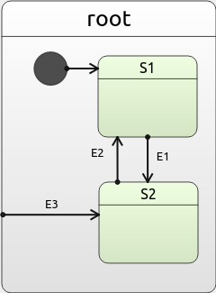
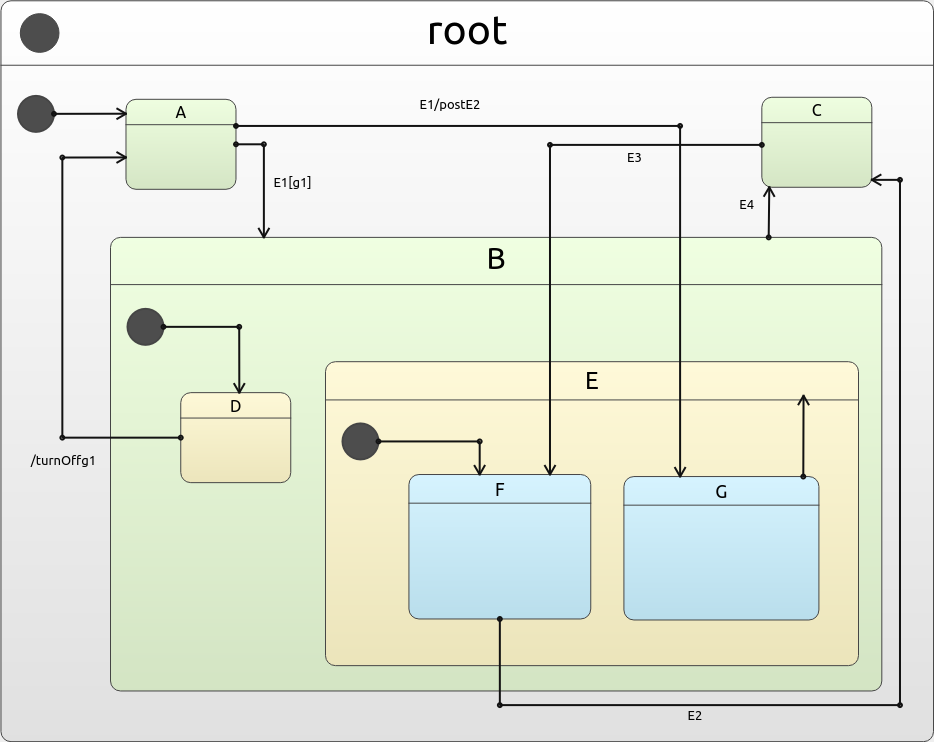
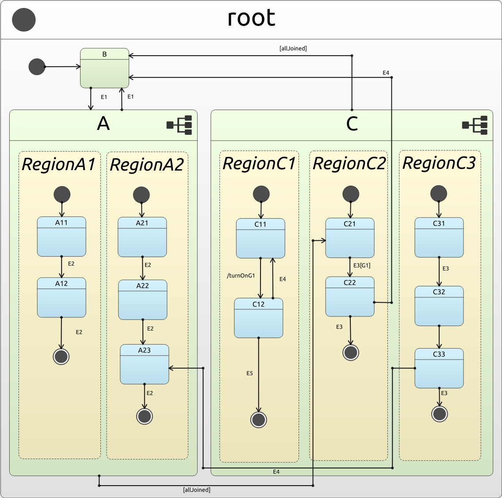
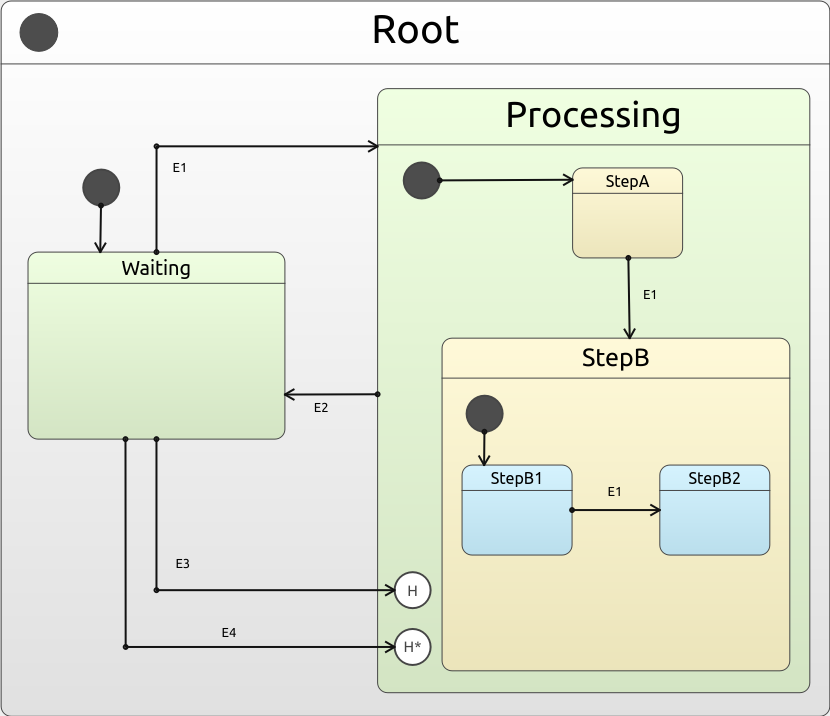

# Examples

Below is a table that explains what each folder contains:

| Name | Description |
| ---  | ------ |
| Instastart | A state machine example that is contained within one file.  Layout not recommended for production.|
| Quickstart | Same state machine as Instastart, but layed out in a proper manner. |
| Example 1 | Multiple composite states, with postFifo, actions and guards, etc. |
| Ortho | Orthogonal states. |
| History | Shallow and Deep History states. |

## More information
Our developer guide covers all of these in detail [here](../DevGuide.md).  See graphical representations of each example below:

### Instastart and Quickstart

### Example 1

### Ortho

### History

